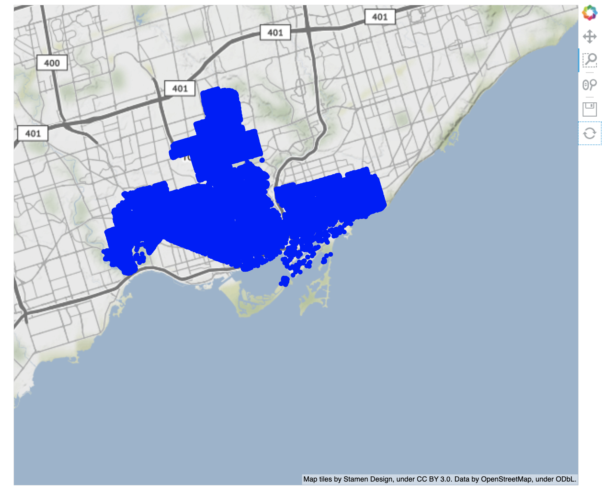
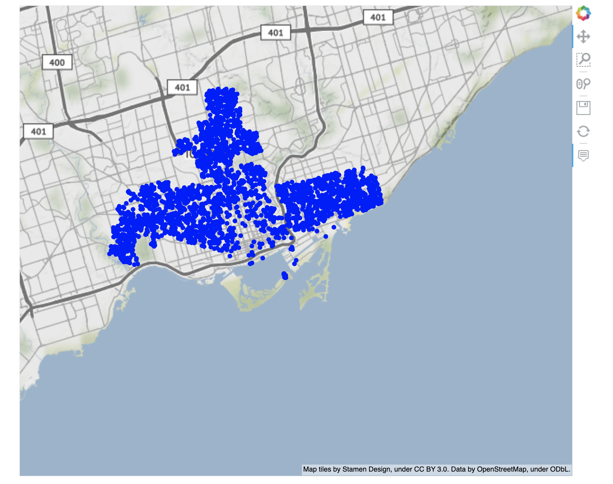
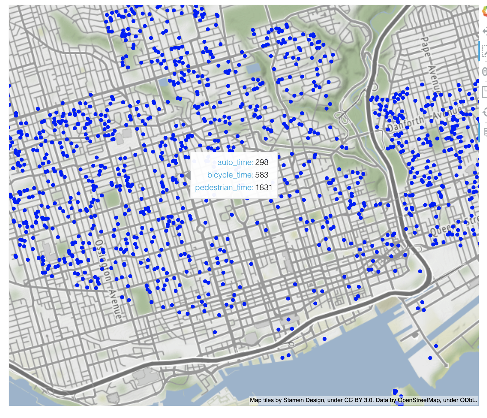
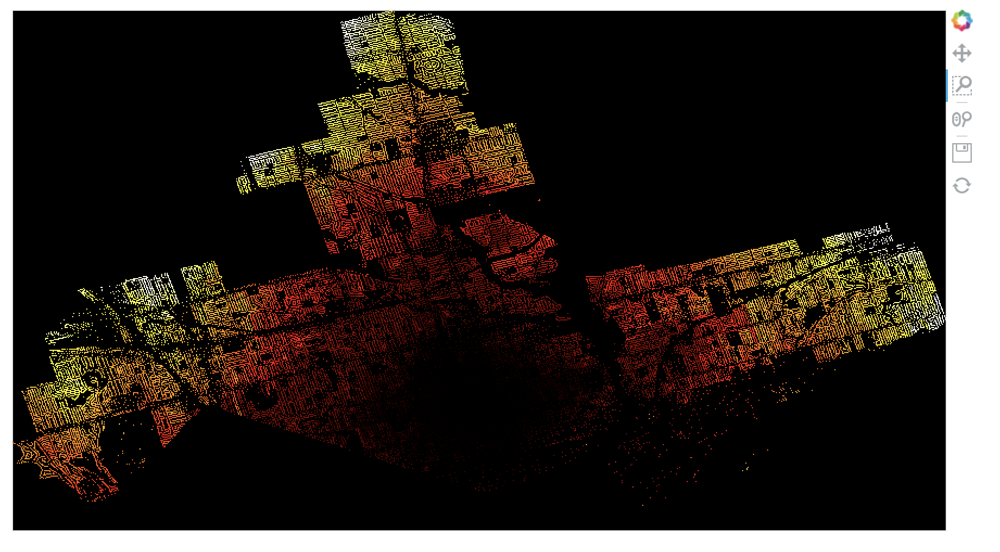

# Examining modal tradeoffs and trends in potential mobility in NYC and Toronto
# Brenda Li

## Background
I’m currently working on a research project with a professor where we’re examining trends in mobility across different cities around the world, and we're interested in how travel times for trips may differ based on neighborhood and mode of transportation.  Specifically, we want to know how the travel times for walking, biking, driving, and taking public transport differ for getting from point A in the city to point B in the city.  In past work, we've looked at the modal tradeoffs within Chicago and found that Census tracts with larger proportions of Black and Hispanic population tended to have slower speed/lower potential mobility for non-driving modes than Census tracts with lower proportions of Black and Hispanic populations.  These differences in modal tradeoffs indicate inequities in access to both reliable public transportation as well as walkable built environments.  As a next step, we're hoping to expand this analysis to different cities around the world.  Then, by comparing these modal tradeoffs for different cities, we hope to glean what aspects of the built environment make one city more friendly for public transportation than another. 

In the past work looking at modal tradeoffs within Chicago, we were examining travel times between individual Census tracts.  However, Census tracts can be fairly large, and there could be variations in transportation access within a single Census tract.  Therefore, it would be better if we could calculate travel times and modal tradeoffs on a finer grained scale, for example on a building to building level.  Conventionally, this would be very time consuming to run since this involves many point-to-point calculations.  However, employing large-scale computing tools would allow us to scale up and get the more detailed results we want.

For this project, I set out to calculate travel times between every building in a city to the city center via various modes of transportation including driving, biking, walking, and public transportation.  The two cities I worked with were Toronto (with the city center set as the center of downtown) and New York City (with the city center set as Grand Central Station).

## Workflow
1. [Preprocessing](1_Preprocessing)
- Dask_Prepare Inputs-City.ipynb
- Batch_public_transport-City.ipynb
2. [Calculations](2_Calculations)
- Set up EC2s - City.ipynb
- build_City.sh 
3. [Analysis](3_Analysis)
- Combine Output-City.ipynb
4. [Visualizations](4_Visualizations)
- Visualizations-City.ipynb

## Data
For this project, I used the following input datasets
- Buildings footprint data, which came in the form of a geojson file and provides the location of every building in the city.  This data was constructed using satellite imagery and each row in the dataset represents one building and contains a Polygon shape object for the building.
- OpenStreetMap (OSM) data on the street, bicycle, pedestrian, and transit networks within each of the geographies.  This dataset is fed into Valhalla (the routing package that I used) to calculate driving, biking, walking, and public transit trip durations.
- City boundaries data in cases where the buildings footprint data was for a large geography than the city.  For example, I was only able to find the buildings footprint data for the entire province of Ontario, and so I used the city boundaries data (which is essentially a shape object) to narrow down the buildings footprint data to the relevant geography.

## Methods and Tools

### 0. Data Storage
Throughout this process, all intermediate and final datasets were stored in an S3 bucket.  Bash scripts and configuration files for the calculation step were also stored in this bucket so that they could be easily copied to each of the EC2 instances running the data processing.

### 1. Preprocessing
In order to prepare the data for calculating travel times, I needed to reduce each building geometry to be represented by a single point.  To do this, I decided to calculate the centroid of each building geometry using Python's geopandas library.  Since the buildings footprint datasets were rather large and the centroid calculation is at the row level (and therefore embarassingly parallelizable), I used Dask on an EMR cluster to carry out the computations.  Within this EMR cluster, I also used the Python library dask-geopandas, which parallelizes basic element-wise spatial methods (including .centroid()) using Dask dataframes.  In the case of Toronto, I also needed to filter down the Ontario buildings dataset to just buildings within Toronto city limits, so dask-geopandas also proved helpful for this computation as well.  Finally, taking this lat/long data, I then formatted them into JSON objects with the additional parameters required for each type of query I was going to be sending to the Valhalla API.

### 2. Calculations
To actually calculate travel times between each building and the city center, I used an open-source routing engine called Valhalla.  This Python library essentially sets up a C++ based API that's being run locally on your machine and allows you to send query requests for the travel time or route between two points by various modes of transportation.  For modes like driving, biking, and walking, the API allows you to send a matrix with origins and destinations with each query and returns a JSON object with travel times in response.  Perhaps because it took a long time to send a large amount of data to the API, I found that it was much faster performance-wise to use more queries with smaller data packages rather than a few queries with larger data packages.  Valhalla doesn't currently support matrix calculations for public transit travel times, and so I used their regular routing engine to get trip duration for public transportation.  Unfortunately, the routing engine only accepts one origin and destination at a time, so for this step I had to make many more queries to the API.

Instead of installing Valhalla by scratch, I decided to use their packaged Docker container that simply required a link to the OSM data for the desired geography.  Using the configuration file, I was also able to customize the set up to allow for larger matrix sizes for the driving, biking, and walking calculations.

To scale up this series of requests, I spun up the Valhalla Docker container on 4 separate EC2 instances and ran a batch of computations on each instance.  Since the setup was identical across each instance (besides the input file), I used Boto3 and Paramiko to spin up each instance and run bash scripts for the required initial installations and copying of necessary files.  Then, I had a separate bash script that carried out the actual computations.  Because I found Paramiko connections to be a little finicky for this longer processing script, I manually ssh-ed into each instance and ran the bash script in there for more flexible troubleshooting.

### 3. Analysis
To assemble the results from the various datasources, I simply read in the output files from the S3 bucket using Boto3 and carried out the processing locally.  At this stage, I appended all the output files for each mode of transportation and then merged each of the datasets together to be one row per building, with columns for the lat/long of the building as well as the time it takes to get to the city center via each mode of transportation.  

I also created a new variable that was the ratio of the public transportation trip duration to the driving trip duration as a measure of public transit accessibility for that origin.  Larger ratios would mean that it takes a lot more time to take public transit than to drive, suggesting that the origin is poorly connected to the city center via the public transportation network.  However, due to the sparsity of public transit trip times I was actually able to get from Valhalla (see Limitations and challenges section), this field was unfortunately mostly missing.

### 4. Visualizations
I used Holoviews to visualize the distribution of buildings in each city and the travel times by mode, and I used Datashader to create heat maps for the average time it takes to get to city center by mode.

## Results
Below are some examples of visualizations from the Toronto output:  
So here a map made with holoviews of the distribution of buildings in my Toronto dataset.  As we can see, there are a ton of points, which makes it hard to glean much from this.

Therefore, we can sample to just a random selection of points to get a clearer view.

Now when we zoom in, we can see that there are certain regions with more clumps of buildings than other, and we can hover over a point to find the travel time by mode of transit

Finally we can also use datashader to create a heat map.  For instance, here we’re looking at how long it takes to get to city center by car, with white and yellow being longer amounts of time and orange and red being shorter amounts of time.  This is a sort of trivial example because we'd expect buildings closer to the city center to require shorter travel times, but it's still a good proof of concept of how datashader can be used to visualize our results.

## Limitations and challenges
Some of the challenges I ran into during this project included:
- Valhalla itself was not speed-optimized.  When I realized that each of my queries were taking longer than I had expected, I did some further research into Valhalla and found a thread where one of the Valhalla developers explained that Valhalla was optimized for runtime flexibility but not for speed.  In fact, they suggested using a different routing agent for larger problem sizes.  Because Valhalla is a fairly complex library and routing calculations are pretty complicated, I didn't think it would be feasible for the scope of this project for me to go into the source code to parallelize at a lower, more detailed level than simply splitting computations between different instances.  Thus, though I had originally wanted to calculate travel times from each building in the city to every other building in the city, I ultimately had to scale down to calculating travel times from each building to a single point at the city center.  
- As mentioned earlier, Valhalla's matrix calculation engine for calculating trip duration between a matrix of origins and destinations doesn't currently support trips via public transportation.  In fact, when I researched other routing libraries and tools, I found that many also didn't support matrix calculations of trip duration for trips using public transit.  Therefore, I had to use Valhalla's single origin-destination routing engine, which ended up being a lot more time consuming.
- Another unexpected barrier was that a large subset of origin-destination pairs would not yield any public transit routes according to Valhalla.  I spot-checked a few origin-destination pairs that returned null results using Google Maps and found that there were pretty reasonable public transit routes between them, so I think something must have been configured incorrectly in my Valhalla setup.  For instance, perhaps I set too strict of a limit on how much walking is acceptable in a trip utilizing public transit.  I spent a while digging around the Valhalla configuration files to see if there was anything I could toggle, but ultimately couldn't identify the issue.

## Future Work and Improvements
As mentioned, this project is an extension of a current project I'm working on comparing transportation accessibility across various international cities.  Some of the other factors and considerations we discussed but I didn't get a change to implement in this project include:
- Incorporating traffic data into the calculation of travel times.  This would probably involve having to use a different routing engine because Valhalla does not support traffic influenced routing at this current time.
- Incorporating data on travel demand.  In this case, I'm calculating travel times between every building in a city and the city center, but I'm not factoring how often such trips are actually made in reality.  For instance, if nobody ever travels from Building A to the city center, but many people travel from Building B to the city center, it is more important from an urban planning perspective that Building B is well connected via public transit than it is for Building A to be well connected via public transit.
- Finally, it would be ideal to be able to scale up to calculating travel times between every building in a city to every other building in the city (as I had originally planned).
